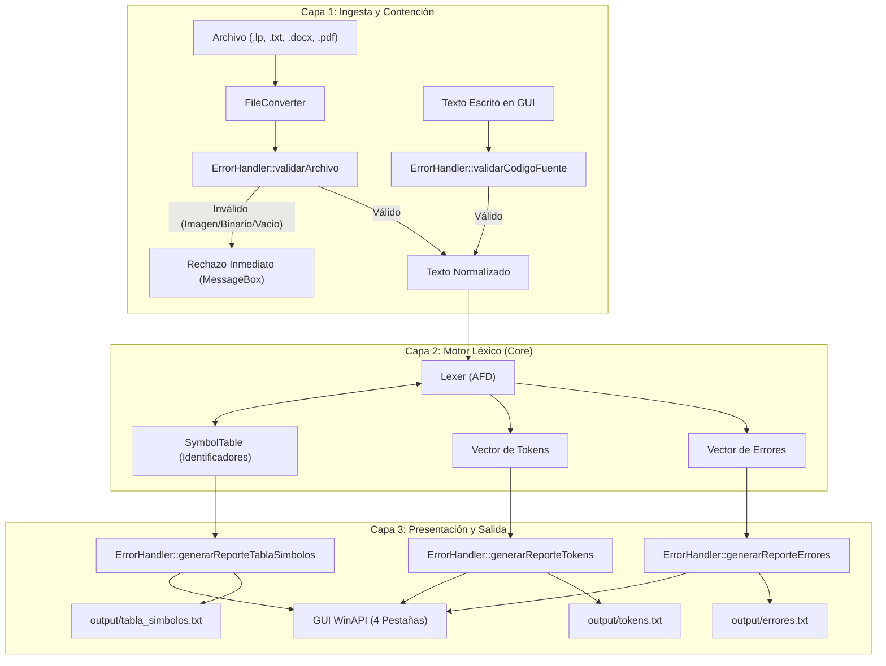

# Arquitectura del Sistema - Analizador Léxico LP

Este documento describe la arquitectura de software, los modelos de autómatas finitos deterministas (AFD), los flujos de datos y los principios de diseño aplicados en el desarrollo del compilador para el lenguaje **LP (Lenguaje de Programación)**.

---

## 1. Visión General de la Arquitectura

El sistema está diseñado bajo un enfoque modular desacoplado en C++20, estructurado en capas con responsabilidades delimitadas:

---

## 2. Diagrama de Estados Finitos (AFD) del Analizador Léxico

El núcleo de escaneo léxico implementa un autómata finito determinista para clasificar el flujo continuo de caracteres:

```mermaid
stateDiagram-v2
    [*] --> INICIO

    INICIO --> NUM_ENTERO : Dígito [0-9]
    NUM_ENTERO --> NUM_ENTERO : Dígito [0-9]
    NUM_ENTERO --> NUM_PUNTO : Punto [.]
    NUM_PUNTO --> NUM_DECIMAL : Dígito [0-9]
    NUM_DECIMAL --> NUM_DECIMAL : Dígito [0-9]
    NUM_DECIMAL --> ERROR_NUM : Punto adicional [.]
    NUM_ENTERO --> ERROR_ID_NUM : Letra [a-zA-Z_]

    INICIO --> IDENTIFICADOR : Letra [a-zA-Z_]
    IDENTIFICADOR --> IDENTIFICADOR : Alfanumérico [a-zA-Z0-9_]
    IDENTIFICADOR --> EVAL_PALABRA_CLAVE : Delimitador / Espacio

    INICIO --> CADENA_TEXTO : Comilla ["]
    CADENA_TEXTO --> CADENA_TEXTO : Caracteres != ["]
    CADENA_TEXTO --> FIN_CADENA : Comilla ["]
    CADENA_TEXTO --> ERROR_CADENA : Fin de línea / EOF

    INICIO --> COMENTARIO_LINEA : Barra [/] + [/]
    COMENTARIO_LINEA --> INICIO : Salto de línea [\n]

    INICIO --> COMENTARIO_BLOQUE : Barra [/] + [*]
    COMENTARIO_BLOQUE --> INICIO : [*] + [/]

    INICIO --> OPERADOR : [=, +, -, *, /, %, <, >, !, &]
    OPERADOR --> TOKEN_EMITIDO : Simbolo simple o compuesto

    INICIO --> DELIMITADOR : [(, ), [, ], {, }, ,, ;]
    DELIMITADOR --> TOKEN_EMITIDO : Token especial

    INICIO --> ERROR_CARACTER : Caracter no reconocido (@, $, #)
```

---

## 3. Descripción de Módulos y Responsabilidades

| Módulo | Archivos | Responsabilidad Primaria |
|---|---|---|
| **Token** | `Token.h`, `Token.cpp` | Definición de tipos léxicos (`LexTokenType`), estructura de metadatos de tokens y mapeo a categorías oficiales de la cátedra. |
| **Tabla de Símbolos** | `SymbolTable.h`, `SymbolTable.cpp` | Almacenamiento asociativo de identificadores, garantizando que cada identificador conserve una posición única (base 0) e historial de apariciones. |
| **Lexer** | `Lexer.h`, `Lexer.cpp` | Implementación del autómata finito determinista (AFD) para la tokenización de texto y detección de incidencias léxicas. |
| **ErrorHandler** | `ErrorHandler.h`, `ErrorHandler.cpp` | Contención de entradas anómalas (imágenes, ejecutables, valores muertos), validación de precondiciones y generación estructurada de reportes. |
| **FileConverter** | `FileConverter.h`, `FileConverter.cpp` | Ingesta multiformato (`.lp`, `.txt`, `.docx`, `.pdf`) y descompresión de contenido textual en memoria. |
| **GUI WinAPI** | `main.cpp` | Interfaz gráfica nativa de Windows con pestañas interactivas, vinculación de eventos y persistencia en disco. |
| **Suite de Pruebas** | `tests/test_lexer.cpp` | Batería de 6 pruebas unitarias automatizadas con assertions para verificación continua de calidad. |

---

## 4. Estrategia de Contención de Errores

Para garantizar la estabilidad del compilador y evitar comportamientos indefinidos o cuelgues, se diseñó una estrategia de **blindaje en tres niveles**:

### Nivel 1: Validación Preventiva de Archivos (Pre-ingesta)
Antes de que cualquier flujo de bytes ingrese al motor:
1. **Detección de formato gráfico**: Se interceptan extensiones como `.png`, `.jpg`, `.jpeg`, `.gif`, `.bmp`, `.webp`, `.svg`, etc., notificando inmediatamente al usuario mediante un cuadro de diálogo claro y explícito en lugar de intentar analizar píxeles como código.
2. **Detección de ejecutables y binarios**: Se bloquean archivos `.exe`, `.dll`, `.bin`, `.zip`, `.rar`, etc.
3. **Detección de archivos multimedia**: Bloqueo de archivos de audio y video.
4. **Inspección de integridad de bytes**: Se verifica la ausencia de caracteres nulos (`\0`) en archivos de texto para evitar inyecciones de bytes binarios corruptos.

### Nivel 2: Detección de Valores Muertos (Pre-análisis)
Si el usuario pulsa *Analizar* con el editor vacío o únicamente con espacios, saltos de línea y tabuladores:
* El módulo `ErrorHandler::validarCodigoFuente` intercepta la solicitud y previene la ejecución inútil del analizador, guiando al usuario con una sugerencia de acción.

### Nivel 3: Recuperación de Errores Léxicos (En ejecución)
Si durante el análisis léxico se detectan caracteres ajenos al alfabeto de LP:
* El analizador **no aborta la ejecución** (modo *panic-mode* recuperable).
* Registra el error en la colección de incidencias, almacena la línea y el lexema causante, y continúa con el siguiente carácter para identificar todos los errores presentes en el programa de una sola pasada.

---

## 5. Salidas Generadas y Persistencia

Al finalizar cada análisis exitoso o con advertencias, el sistema genera de forma concurrente tres representaciones:

1. **Tokens (`output/tokens.txt`)**:
   * Secuencia en formato estándar LP (`<VOID> <MAIN>...`).
   * Tabla analítica con columnas: `#`, `TOKEN`, `LEXEMA`, `CATEGORIA DEL TOKEN`, `LINEA`.
2. **Tabla de Símbolos (`output/tabla_simbolos.txt`)**:
   * Listado de identificadores únicos con posición base 0, línea de primera aparición y trazabilidad de todas sus apariciones en el código.
3. **Reporte de Errores (`output/errores.txt`)**:
   * Inventario de incidencias léxicas con ubicación exacta y descripción detallada del motivo de error. Si no hay errores, se certifica la validez al 100%.
