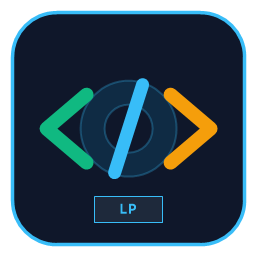

# Compiladores - Analizador Léxico para Lenguaje LP

<p align="center">
  
  <br>
  <strong>Compilador y Analizador Léxico para el Lenguaje LP (C++20)</strong>
</p>

Analizador léxico desarrollado en C++20 para el lenguaje simplificado **LP (Lenguaje de Programación)**, con interfaz gráfica nativa en Windows (WinAPI), versión CLI multiplataforma (Linux/Docker/Windows), tabla de símbolos integrada, soporte multiformato (.lp, .txt, .docx, .pdf), módulo unificado de contención de errores y suite de pruebas unitarias automatizada.

---

## 📚 Documentación del Proyecto

Para consultar los detalles técnicos, guías y registros de evolución del proyecto, consulta los siguientes documentos:

* 📄 **[Changelog (Registro de Cambios)](CHANGELOG.md)**: Historial completo de versiones, nuevas características, correcciones y notas de lanzamiento bajo el estándar *Keep a Changelog* y *SemVer*.
* 🛠️ **[Documentación Técnica de Funciones](DOCS_FUNCIONES.md)**: Detalle exhaustivo de todas las clases, estructuras, enumeraciones, métodos, algoritmos y firmas de funciones en el código fuente.
* 🏛️ **[Arquitectura del Sistema](ARQUITECTURA.md)**: Modelo arquitectónico, diseño de autómatas finitos deterministas (AFD) con diagramas Mermaid, pipeline de datos y estrategia de contención de errores en 3 niveles.
* 📖 **[Manual de Usuario](MANUAL_USUARIO.md)**: Guía paso a paso para ejecutar la aplicación, operar la interfaz gráfica de 4 pestañas, cargar archivos y consultar los reportes exportados en `output/`.

---

## 1. Especificación Léxica de LP

### 1.1 Números e Identificadores
* **NUM_INT**: Dígitos enteros `[0-9]+` &rarr; `<NUM_INT>`
* **NUM_DEC**: Dígitos decimales `[0-9]+\.[0-9]+` &rarr; `<NUM_DEC>`
* **ID**: Identificadores `[a-zA-Z_][a-zA-Z0-9_]*` &rarr; `<ID,pos>` *(donde pos es su índice único en la tabla de símbolos)*
* **TEXTO**: Cadenas de caracteres `"..."` &rarr; `<TEXTO>`

### 1.2 Palabras Reservadas
| Lexema | Token | Lexema | Token |
|---|---|---|---|
| `int` | `<INT>` | `void` | `<VOID>` |
| `float` | `<FLOAT>` | `main` | `<MAIN>` |
| `char` | `<CHAR>` | `if` | `<IF>` |
| `boolean` | `<BOOLEAN>` | `else` | `<ELSE>` |
| `for` | `<FOR>` | `while` | `<WHILE>` |
| `scanf` | `<SCANF>` | `println` | `<PRINTLN>` |
| `return` | `<RETURN>` | `string` | `<STRING>` |

### 1.3 Operadores
* **Asignación:** `=` &rarr; `<=>`
* **Aritméticos:** `+` &rarr; `<+>`, `-` &rarr; `<->`, `*` &rarr; `<*>`, `/` &rarr; `</>`, `%` &rarr; `<%>`
* **Lógicos:** `&&` &rarr; `<&&>`, `||` &rarr; `<||>`, `!` &rarr; `<!>`
* **Comparación:** `>`, `>=`, `<`, `<=`, `!=`, `==` &rarr; `<COMP>`

### 1.4 Delimitadores y Símbolos Especiales
* `(` &rarr; `<(>`, `)` &rarr; `<)>`
* `[` &rarr; `<[>`, `]` &rarr; `<]>`
* `{` &rarr; `<{>`, `}` &rarr; `<}>`
* `,` &rarr; `<,>`, `;` &rarr; `<;>`

### 1.5 Comentarios
* De una línea: `//.*\n` &rarr; Reconocidos y descartados.
* De bloque: `/* ... */` &rarr; Reconocidos y descartados.

---

## 2. Ejemplo Oficial de Ejecución

### Código Fuente de Entrada:
```c
void main() {
int edad = 20;
float promedio = 15.5;
if (edad >= 18 && edad <= 60) {
println("Edad valida");
}
return;
}
```

### Secuencia de Tokens Resultante:
```text
<VOID> <MAIN> <(> <)> <{>
<INT> <ID,0> <=> <NUM_INT> <;>
<FLOAT> <ID,1> <=> <NUM_DEC> <;>
<IF> <(> <ID,0> <COMP> <NUM_INT> <&&> <ID,0> <COMP> <NUM_INT> <)> <{>
<PRINTLN> <(> <TEXTO> <)> <;>
<}>
<RETURN> <;>
<}>
```

### Tabla de Símbolos:
| Posición | Identificador | Línea Inicial | Apariciones |
|---|---|---|---|
| 0 | `edad` | Línea 2 | L2, L4, L4 |
| 1 | `promedio` | Línea 3 | L3 |

---

## 3. Compilación y Ejecución

### 3.1 Aplicación Visual (GUI Windows)
```powershell
cmake --build cmake-build-debug --target Compiladores
.\cmake-build-debug\Compiladores.exe
```

### 3.2 Aplicación por Consola (CLI Multiplataforma)
```powershell
cmake --build cmake-build-debug --target compilador_lp
.\cmake-build-debug\compilador_lp.exe input/ejemplo.lp
```

### 3.3 Ejecutar Pruebas Automatizadas:
```powershell
cmake --build cmake-build-debug --target test_lexer
.\cmake-build-debug\test_lexer.exe
```

---

## 4. 🐳 Entorno Docker (Dockeado)

El proyecto incluye soporte completo para ejecución contenedorizada en Linux mediante Docker y Docker Compose:

### Construir y Ejecutar con Docker:
```bash
# Construir la imagen optimizada
docker build -t compiladores-lp .

# Ejecutar el analizador sobre el archivo por defecto
docker run --rm -v $(pwd)/output:/app/output compiladores-lp

# Ejecutar sobre un archivo específico
docker run --rm -v $(pwd)/input:/app/input -v $(pwd)/output:/app/output compiladores-lp input/mi_codigo.lp

# Ejecutar la suite de pruebas unitarias
docker run --rm --entrypoint /app/test_lexer compiladores-lp
```

### Uso con Docker Compose:
```bash
# Levantar y procesar input/ejemplo.lp
docker compose up compilador

# Ejecutar pruebas unitarias
docker compose run --rm test
```

---

## 5. Publicar Release en GitHub:
```powershell
.\release.ps1 1.0.0
```
